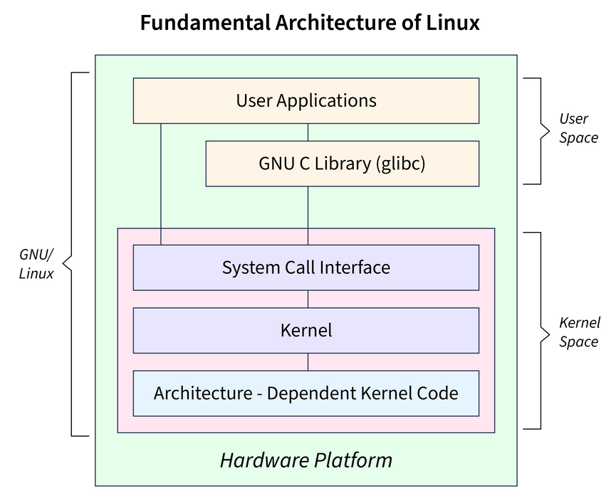

* **Linux architecture & system calls.**
  
  
  System calls are the interface from user space to the kernel (e.g., `open`, `read`, `write`, `fork`, `execve`). 

---

* **Purpose of key directories.**
  `/root` of the filesystem 
  `/bin` essential user binaries (e.g., `ls`, `cp`)
  `/sbin` system-admin binaries
  `/usr` user-land apps & libraries (often the largest tree)
  `/etc` system config
  `/var` variable data (logs, caches, spool)

---

* **“Everything is a file” & program vs process.**
  Because treating everything (text, devices, processes, etc.) as files makes the system more `consistent, simple, and flexible.` Programs don’t need special rules for each device — they just use the same basic operations: **open, read, write, close**.
  
  A **program** file containing a set of instructions
  a **process**  A program currently running on the system
