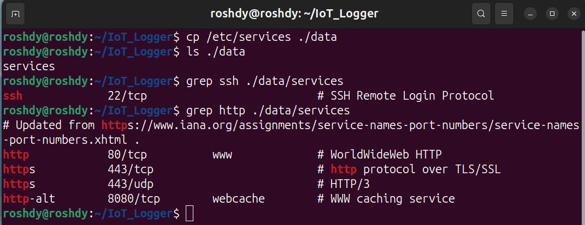
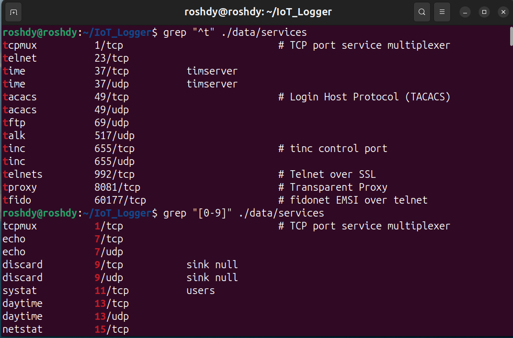

1. **Create log & script placeholders**

2. **Copy `/etc/services` and search**

3. **Regex examples**

4. **Locate & clean text files**

5. **Create hard & symbolic links**

6. **Display project structure**

