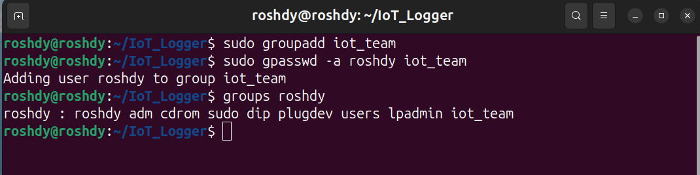
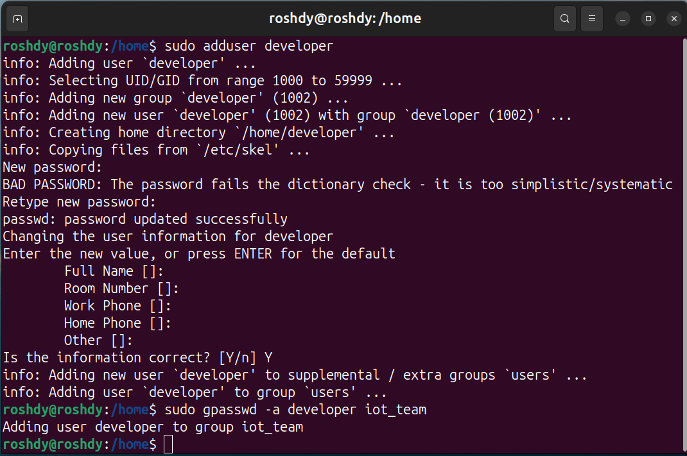
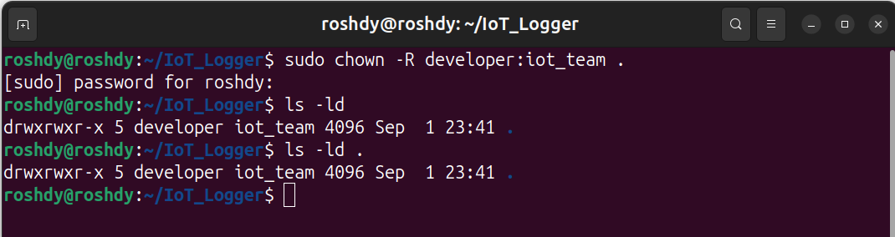
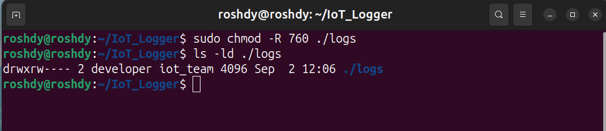
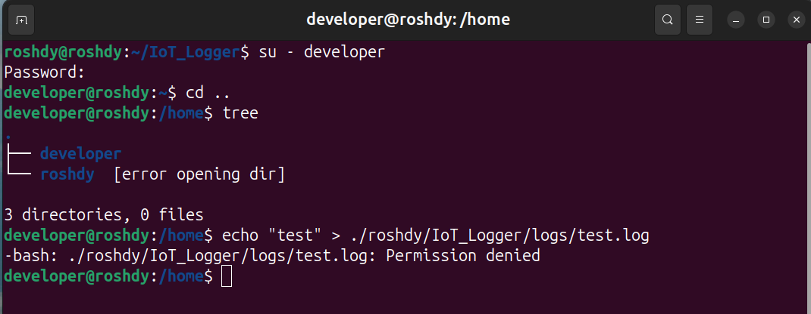

1. **Create group and add yourself**

2. **Create developer user & add to group**

3. **Change ownership of the project**

4. **Set permissions: group rw, others blocked (logs)**

5. **Test as the new user, then remove test user**

Permission denied -> developer user have not access to open directory (roshdy)

