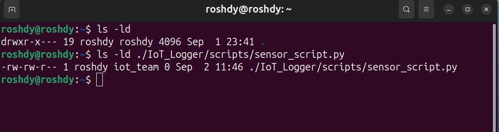

**Linux permissions (r, w, x)**  
Permissions apply differently to **files** vs **directories**:

**For files:**

- `r` → read file contents
- `w` → modify/delete contents
- `x` → execute as a program/script

**For directories:**

- `r` → list files inside
- `w` → create/delete/rename files
- `x` → enter/access the directory (`cd`)

Example:  

---

**Octal Notation for Permissions**

- Each permission has a numeric value:
    
    - `r = 4`, `w = 2`, `x = 1`
    
- Examples:
    
    - `rwx = 7 (4+2+1)`
    
    - `rw- = 6 (4+2)`
    
    - `r-- = 4`

Example:  
`-rwxr-xr-- = 754`

- Owner = `7 (rwx)`
- Group = `5 (r-x)`
- Others = `4 (r--)`

---

**umask**

- **umask** = “mask” that defines default permissions when new files or directories are created.

- Default before applying umask:
    
    - Files = `666` (rw-rw-rw-)
    - Directories = `777` (rwxrwxrwx)
    

Example:  
If `umask = 022`:

- New File = `666 - 022 = 644` → `rw-r--r--`
- New Dir = `777 - 022 = 755` → `rwxr-xr-x`

---

**Root User vs Normal User**

- **Root user (UID = 0):**
    
    - Full control over the system (install software, change ownership, edit configs, kill processes).
    - Prompt = `#`

- **Normal user:**
    
    - Limited to their own files and permissions.        
    - Prompt = `$`

Why root is dangerous:

- Mistakes affect the whole system (e.g., `rm -rf /`). 
- No safety restrictions → can overwrite configs or delete system files.
- Security risk: if compromised, the attacker gains full control.
