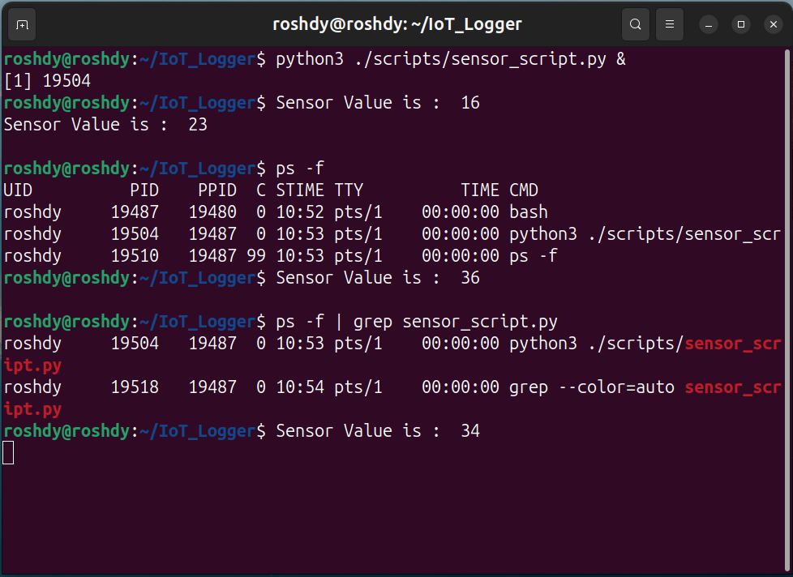
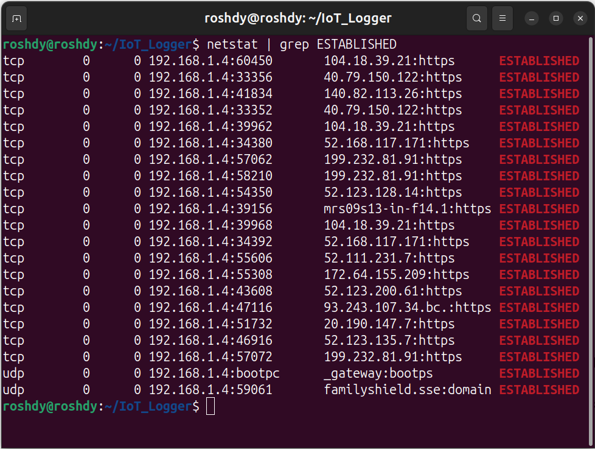
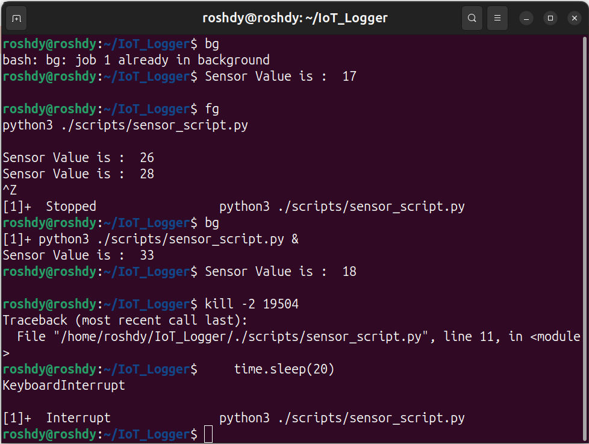

1. **Run a background task to simulate sensor polling**    
2. **List processes and filter for the background task**

**Python Code to Simulate Sensor Polling**

**Run Task in background and Print Process in Details and Filter background Process**

   
---

3. **Check network states (established connections)**

---

4. **Try foreground and background switching**
5. **Kill a process if needed**
  
