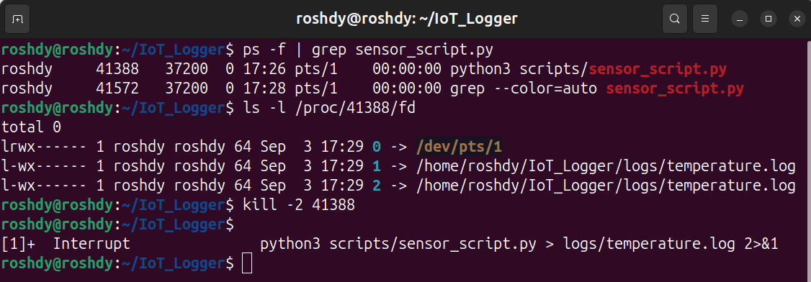

1. **Set env variable**  

2. **Python script** → `scripts/sensor_script.py`    

3. **Redirect output → background**    

4. **Find PID + inspect FD**    

5. **Filter log data**    

6. **Copy logs with wildcards**    

7. **Clear variable**    

---

 * **Challenge: Pipes & FD Inspection**     
