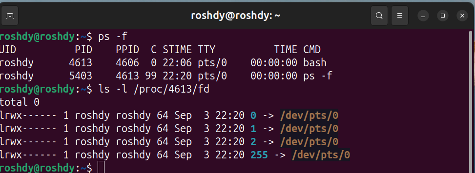

### 1. `' '` vs `" "` in shell

* **Single quotes `' '`** → take the text **literally**. Nothing inside is expanded.
* **Double quotes `" "`** → allow **variable expansion** and command substitution.

---

### 2. `[ -f filename ]` vs `[ -d dirname ]`

* `[ -f filename ]` → true if **filename exists and is a regular file**.
* `[ -d dirname ]` → true if **dirname exists and is a directory**.

---

### 3. stdout/stderr redirection

* **stdout (1)** → normal output (goes to screen by default).
* **stderr (2)** → error messages.

**Redirection operators:**

* `>` → overwrite
* `>>` → append
* `2>` → redirect errors
* `&>` → redirect both stdout & stderr

### 4. Confirming with File Descriptors

Every process has file descriptors:

* `0` → stdin
* `1` → stdout
* `2` → stderr

You can check them in `/proc/<pid>/fd`.        

---
### 5. Simple bash calculator (add/subtract)
* **Script**    

* **Test**    
