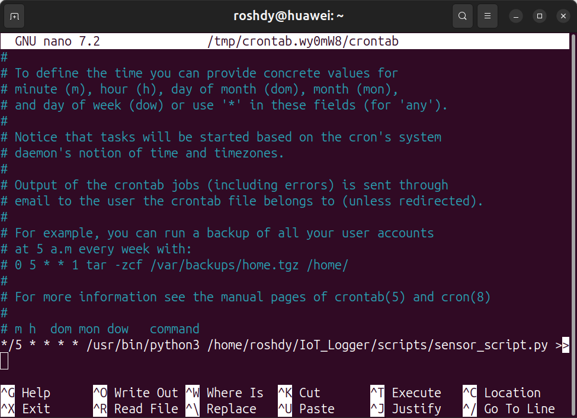

### 1. Configure log rotation for temperature.log

### 2. Test by forcing a rotation

---

### 3. Schedule the Python script to run every 5 min with cron

---
### 4. Verify log growth over time.

---
### 5.Compress old logs into .tar.gz in data

---
### 6. Simulate sending to /home/server/

---

