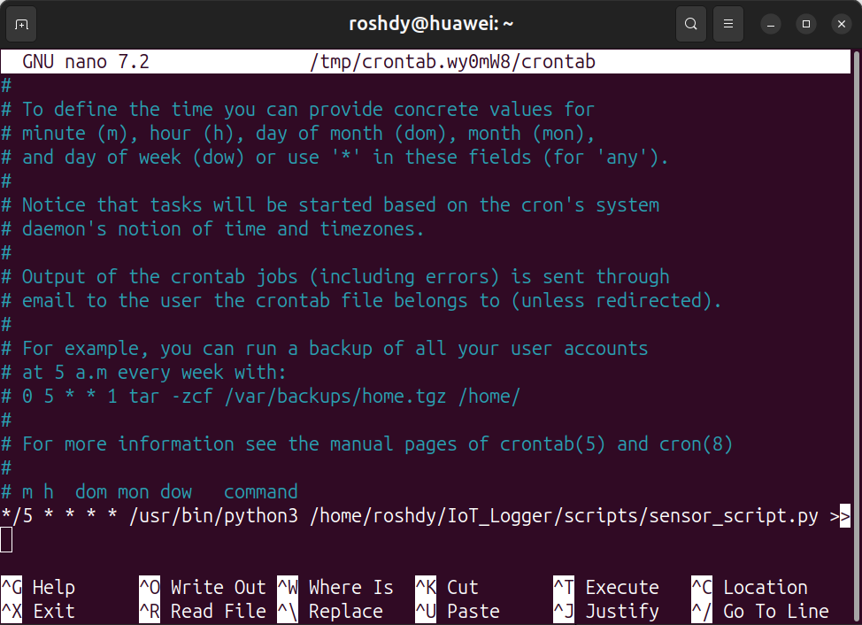
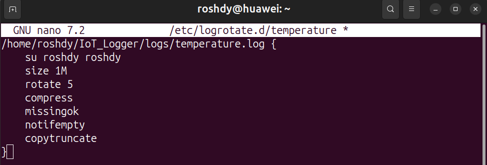

**• How does cron scheduling work? Give a crontab entry every 5 minutes.**

Cron is a background scheduler in Linux that runs commands automatically based on time patterns defined in the crontab file.

Example entry to run a script every 5 minutes:

---

**• Why do we need log rotation? Show an example config.**

Log rotation prevents log files from growing indefinitely and consuming disk space. It automatically archives, compresses, and cleans up old logs.

Example `logrotate` configuration:

---

**• Difference between a Virtual Machine and a Container? Must containers use the same OS as the host?**

* A **Virtual Machine** runs a full operating system on top of a hypervisor, which makes it heavier and slower to boot.
* A **Container** shares the host’s kernel and isolates only the application space, making it lightweight and faster.
* Containers do **not** need to use the *same exact OS*, but they must be **compatible with the host’s kernel**. For example, Linux containers require a Linux kernel.
---
**• Reflection – Which tasks combined Linux concepts, and how is that similar to IoT systems?**

During this project, I noticed that several tasks required combining multiple Linux concepts at the same time instead of using just one command.  
For example:

- **Log redirection (`>>`) + cron scheduling** were used together to automatically collect data every 5 minutes without manual intervention.
- **File compression (`tar` / `gzip`) + archiving + file transfer (`cp` or `scp`)** were combined to prepare old data and move it to another directory or server.
- **Permission control + log rotation (`logrotate`)** were used to make sure files can be rotated safely without causing errors.
- **Process monitoring (`ps`, `top`) + background execution (`&`)** helped verify that the logging script was actually running.

This reflects how real **IoT systems** work in production. Devices continuously generate data, which must be:

1. **Collected automatically**
2. **Logged and stored efficiently**
3. **Compressed to save space**
4. **Archived and transferred to a central server** without human interaction
---
