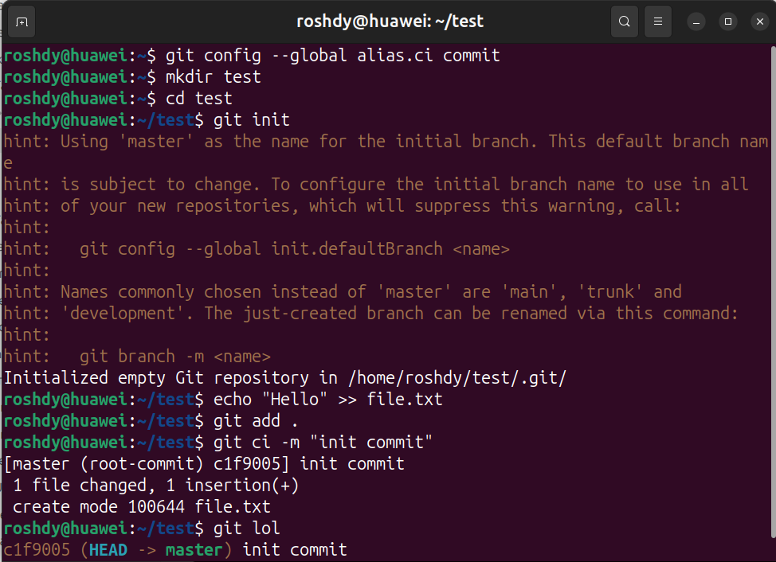

# 1. Open-Ended Questions 

**Q1. Which type of Git object is used to store the contents of a file and how does it fit into Git’s object model?**

- Git stores file contents in **blob objects**.
- Blobs contain the raw data of a file but no filename.

- Filenames are stored in **tree objects**, which map names to blob IDs.
- Commits then reference trees, creating a hierarchy.

```
Commit → Tree → Blob
```

**The Object Model**


---

**Q2. Git allows configuration at system, global, and local levels. Which level takes priority and why is this design useful?**

- **Priority:** Local > Global > System.
    
- This design is useful because it allows project-specific overrides (local), while still maintaining user-wide defaults (global) and machine-wide defaults (system).

| Level                    | Applies To                  | Storage Location              |
| ------------------------ | --------------------------- | ----------------------------- |
| System (machine-wide)    | All users on the machine    | `/etc/gitconfig`              |
| Global (user)            | A single user               | `~/.gitconfig`                |
| Local (project-specific) | A single project/repository | `.git/config` inside the repo |

---

**Q3. Compare `.gitignore` and `.git/info/exclude`.**

- Both tell Git which files to ignore.

| File                | Scope                          | Use Case                                                                         |
| ------------------- | ------------------------------ | -------------------------------------------------------------------------------- |
| `.gitignore`        | Committed and shared with team | Ignore files that should be ignored in **all clones** with collaborators         |
| `.git/info/exclude` | Local-only (not committed)     | Ignore files specific to **your machine** (e.g., editor settings, debug outputs) |

---

**Q4. Difference between `git diff` and `git diff --staged`.**

| Command             | Shows differences between...     |
| ------------------- | -------------------------------- |
| `git diff`          | Working directory ↔ Staging area |
| `git diff --staged` | Staging area ↔ Last commit       |
- Example: Before staging → use `git diff`. After staging → use `git diff --staged`.

---

**Q5. If you accidentally staged a file, how to remove it from staging but keep changes? Why might this be necessary?**

- Use: `git restore --staged <file>`
    
- This is necessary if you added a file to staging by mistake but still want to keep editing it without committing yet.

---

**Q6. Can you alias `git commit` as `git ci`?**

- You can create an alias: `git config --global alias.ci commit`.
- Then `git ci` will work as a shorthand.



---

**Q7. What does `init.defaultBranch` control? Why might teams set it differently?**

It sets the **default branch name** when running `git init`.
Example:
```
git config --global init.defaultBranch main
```
Teams set it to `main`, `develop`, or other conventions depending on workflow or inclusivity preferences.

---

**Q8. Every commit in Git points to at least one tree object. Explain and Why .**

A commit stores:
- Metadata (author, message, parents)
- A **pointer to a tree object**

That tree object represents the **exact snapshot** of the project at that moment. 
Without trees, Git wouldn’t know _what files existed in a commit_ — commits would be meaningless.


---

**Q9. If you have staged changes in `main` and then switch to a feature branch, what happens? Why?**

The staged changes stay staged and move with you.

Reason: Staging area (index) is shared across branches. Git assumes if you staged something, you intend to commit it soon regardless of the branch.

---

**Q10. Difference between `git switch -c feature` and `git checkout -b feature`. Why was `switch` introduced?**

| Command                   | Function                    | Notes                                                                                        |
| ------------------------- | --------------------------- | -------------------------------------------------------------------------------------------- |
| `git checkout -b feature` | Creates and switches branch | **`checkout` Old, overloaded command**                       (also used for restoring files) |
| `git switch -c feature`   | Creates and switches branch | **`switch` Focused on branch operations only**   (introduced to reduce confusion)            |

---

# **2. MCQs – Answers**

1. **c) Automatic bug fixing**
2. **b) On a single central server**
3. **b) Linus Torvalds, 2005**
4. **c) git --version**
5. **c) Clone**
6. **b) Staging area (index)**
7. **b) git branch -M main**
8. **a) git clone**
9. **b) To suggest merging changes from one branch into another**
10. **b) Add Peter as a collaborator**

---

