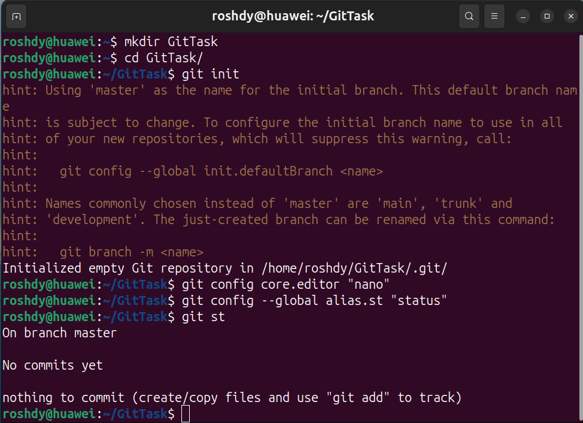
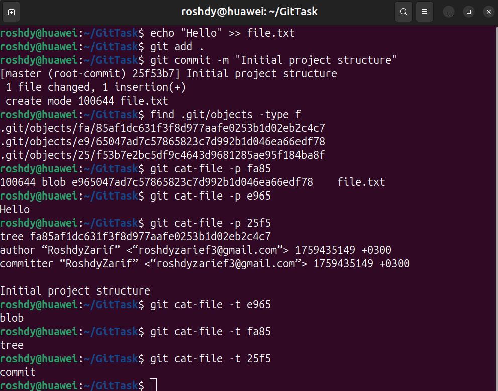
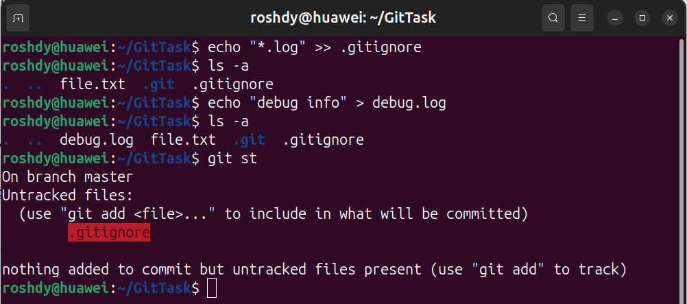
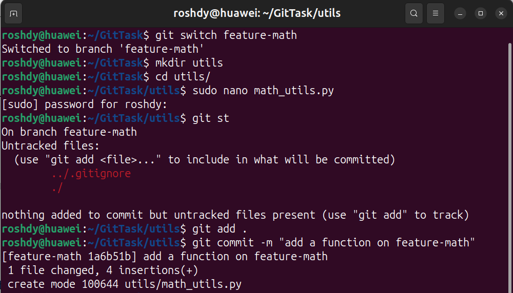
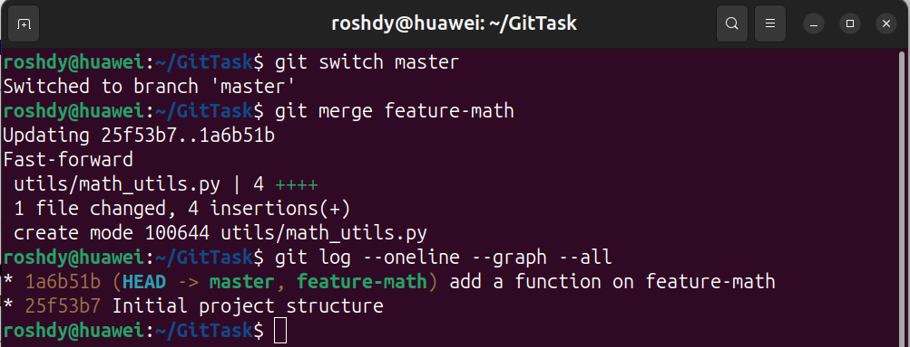
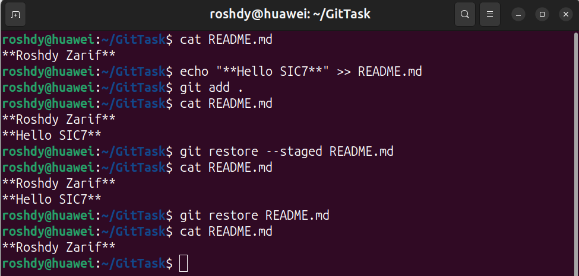
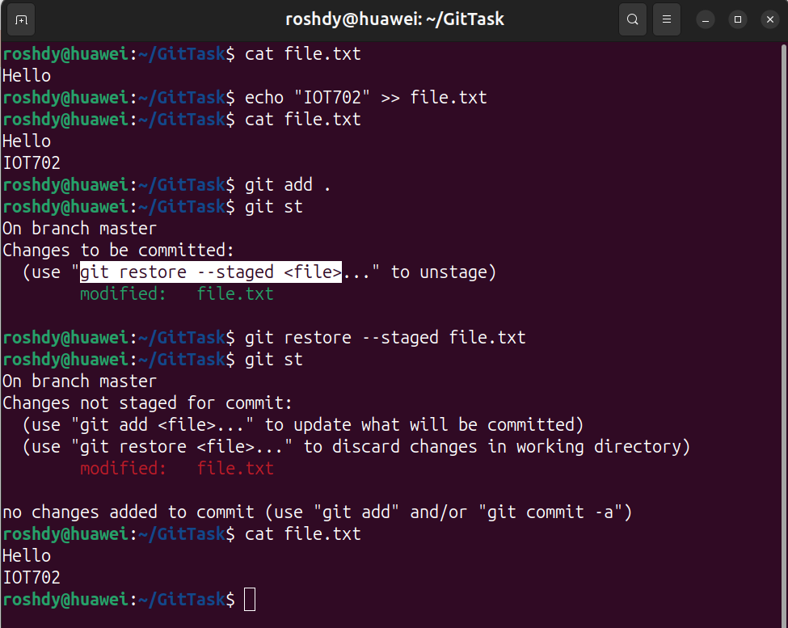
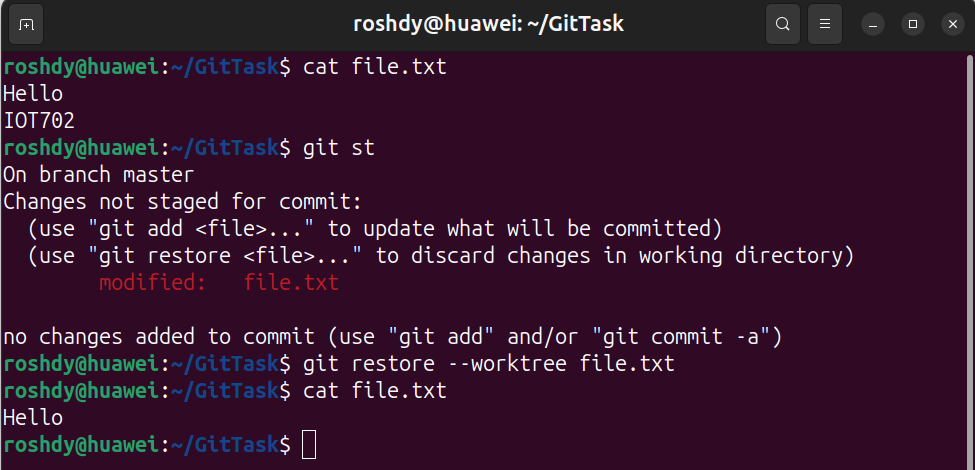
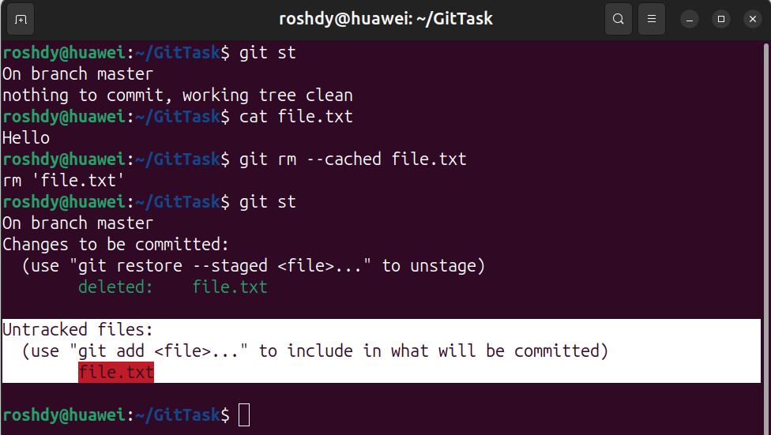
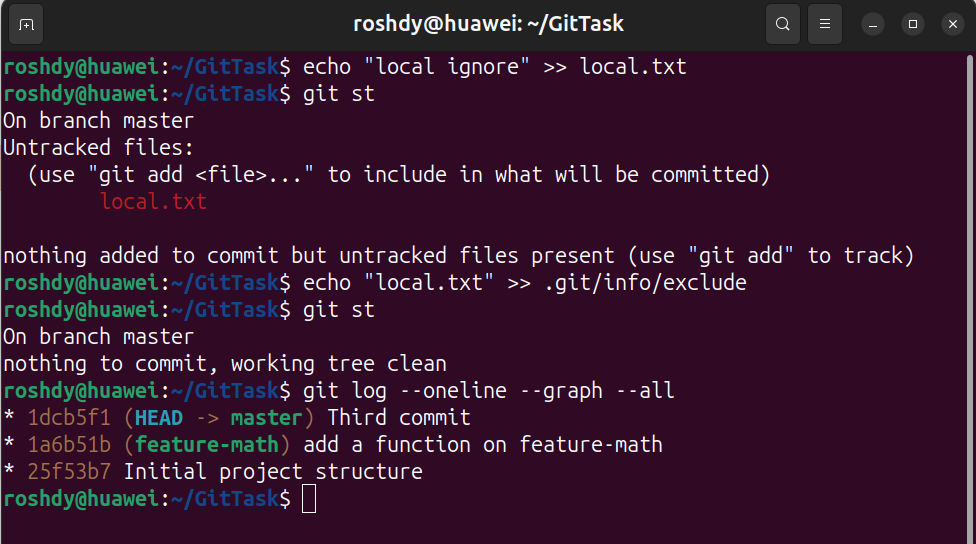

### **1. Setup**

---
### **2. First Commit**

---
### **3. Ignore Files**

---
### **4. New Feature (Branching)**

---
### **5. Merging**

**As shown in the Log History, this is a *Fast-Forward Merge*.**

**Difference Between Fast-Forward and 3-Way Merge**

| Merge Type             | When It Happens                                                          | How It Works                                                                               | Appearance in `git log --graph` |
| ---------------------- | ------------------------------------------------------------------------ | ------------------------------------------------------------------------------------------ | ------------------------------- |
| **Fast-forward merge** | When the base branch (e.g., `master`) has no new commits after branching | Git _just moves the branch pointer forward_ — no new commit is created                     | A straight line                 |
| **3-way merge**        | When both branches have diverged                                         | Git combines three points: common ancestor + both branch tips → creates a **merge commit** | A **Y-shaped** structure        |

---
### **6. Undo / Unstage**

####  Git Scenario: Understanding `git restore --staged`, `git restore --worktree`, and `git rm --cached`

##### Objective

In this scenario, I modified `file.txt` and used three different commands to observe the difference between:
- Unstaging changes (`--staged`)
- Discarding working directory changes (`--worktree`)
- Removing a file from Git tracking (`rm --cached`)

---
##### 1️⃣ Unstage Changes — Using `git restore --staged`

 _(First image)_
 

 **Result:**
- The modification is removed from the **staging area**   
- But it **remains in the working directory**

✔ Best used when you **added something by mistake** and want to unstage it without losing the change.

---
##### 2️⃣ Discard Local Changes — Using `git restore --worktree`

_(Second image)_

 **Result:**
- The file is restored to the **last committed version**
- All local modifications are **discarded**
- **git restore --worktree file.txt == git restore  file.txt**

✔ Used when you want to **completely undo local changes**.

---
##### 3️⃣ Remove File from Git Tracking — Using `git rm --cached`

 _(Third image)_

**Result:**
- The file is **no longer tracked by Git**
- But it **still exists physically** in the working directory

✔ Useful when you want to **keep a file locally but exclude it from Git**, such as secrets or config files.

---
### **7. Bonus Challenge**

---
